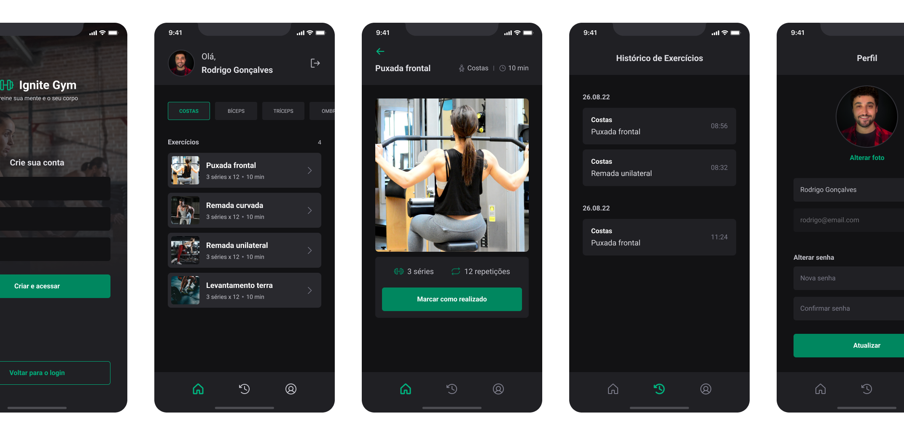

<h1 align="center">
      
     Ignite Gym
</h1>

  <a href="#-technologies">Technologies</a>&nbsp;&nbsp;&nbsp;|&nbsp;&nbsp;&nbsp;
  <a href="#-project">Project</a>&nbsp;&nbsp;&nbsp;|&nbsp;&nbsp;&nbsp;
  <a href="#-layout">Layout</a>&nbsp;&nbsp;&nbsp;|&nbsp;&nbsp;&nbsp;
  <a href="#memo-license">License</a>

 

  

  

## 🚀 Technologies

Technologies used in this project:

- [Node.js](https://nodejs.org/en/)
- [React Native](https://facebook.github.io/react-native/)
- [Expo](https://expo.io/)
- [TypeScript](https://www.typescriptlang.org/)

## 💻 Project

Ignite Gym is a mobile application to manage your gym workouts. In this app you can record your activity histories. And see exercises by muscle groups.

## 🔖 Layout

Below can you find layout of project. But remember you need an account [Figma](http://figma.com/) account to access.

- [Layout](https://www.figma.com/file/dQ5qfFU0ZOKc8WXhZnyKrQ/Ignite-Gym?node-id=37%3A6&t=9SVLOsAte7KFsehu-1)

## :memo: License

This project is licensed under the MIT license. see the file [LICENSE](LICENSE.md) for more details.
